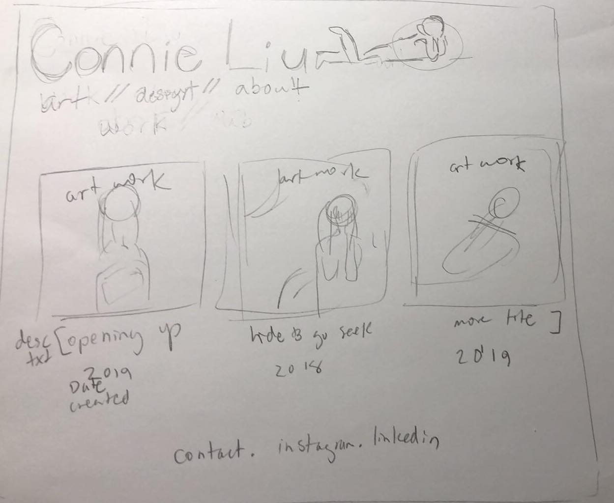
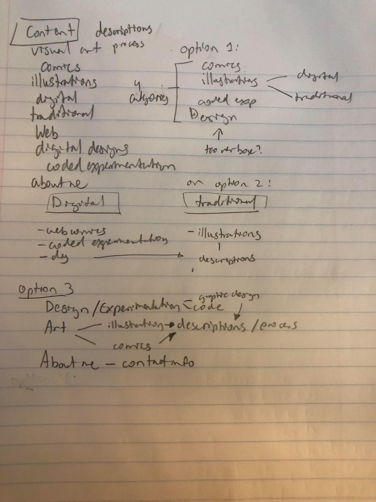
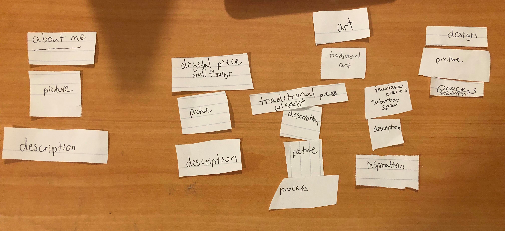
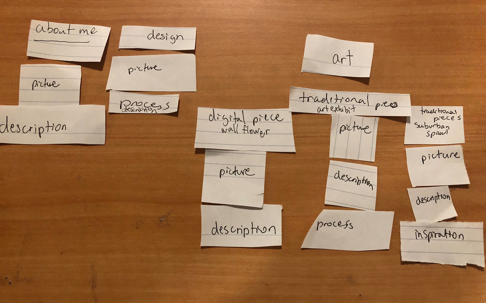
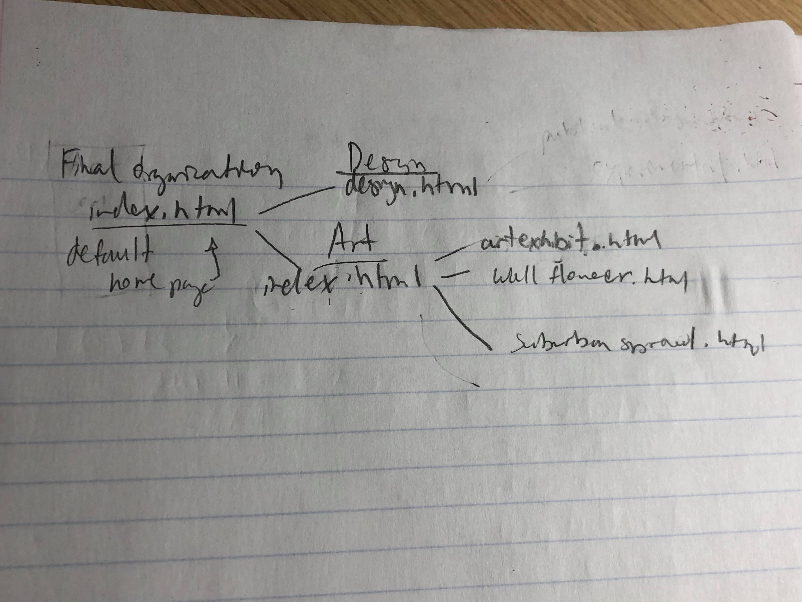
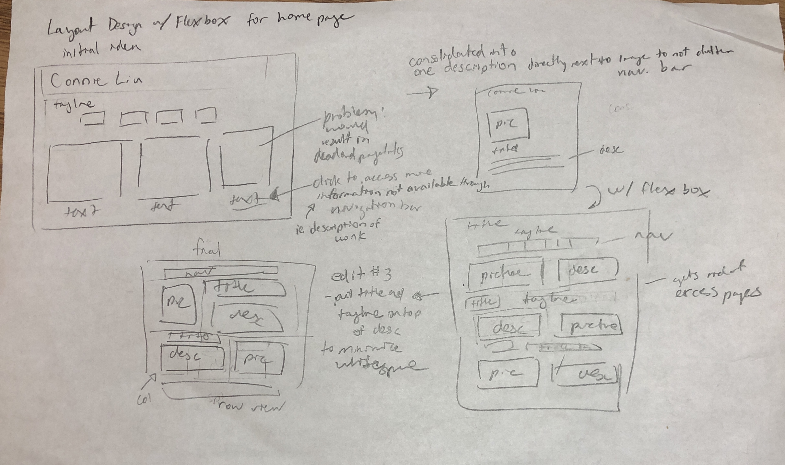
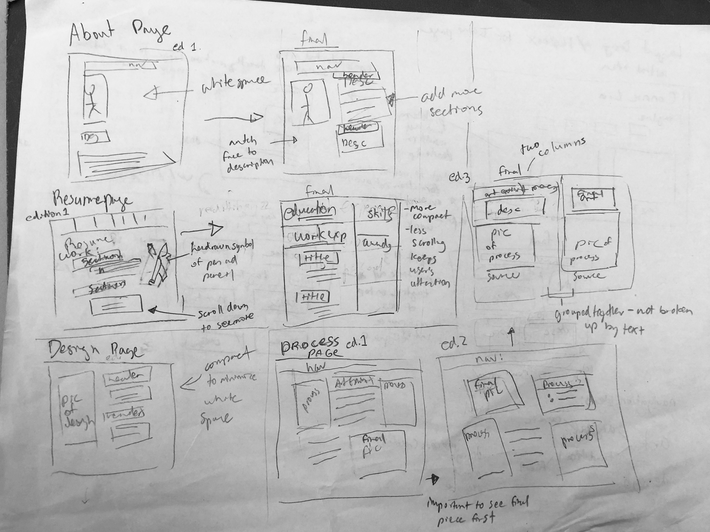
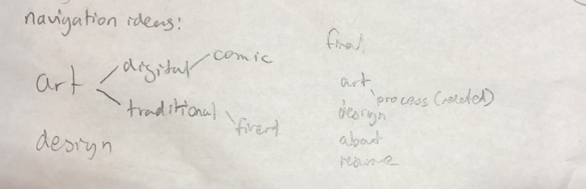
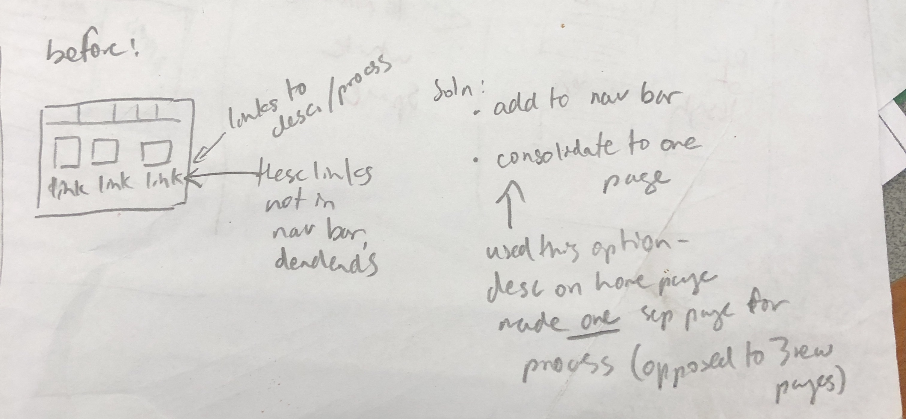

# Project 1 - Design Journey

**For each milestone, complete only the sections that are labeled with that milestone.**

## Markdown Instructions

This is a Markdown file. All written documents that you will submit this semester will be Markdown files. Markdown is a commonly used format by developers and bloggers. It's something that you should know.

The following links are Markdown references:
- <https://guides.github.com/features/mastering-markdown/>
- <https://github.com/adam-p/markdown-here/wiki/Markdown-Cheatsheet>

When writing your Markdown file in Atom. Open the command palette and search for **Markdown Preview: Toggle**. This will open up a panel in Atom where you can preview your formatted Markdown file.

This is how your insert images into your Markdown documents:

## Milestone 1

**Make the case for your decisions using concepts from class, as well as other design principles, theories, examples, and cases from outside of class.**

You can use bullet points and lists, or full paragraphs, or a combo, whichever is appropriate. The writing should be solid draft quality but doesn't have to be fancy.

### Website Topic (Milestone 1)
My website is going to be about my different creative projects ranging from art to code to design pieces. It will include three different sections. One section that is an about me and describes who I am as a person. Another section that has two to three of my art pieces. Clicking on each art piece will lead to explanations about my thought process on them. The third section will have two to three of my design pieces and clicking on them will provide the same information.

### Target Audience (Milestone 1)
The intended target audience for my website will be employers who are looking to hire designers/illustrators. Under the general umbrella of target audiences includes potential clubs or extracurricular activities looking to see if my skills are up to par.

### Final Content (Milestone 1)
The content I intend to include on my final site is autobiographical description about me, a brief list of my accolades, visual examples of my skills, and a photograph of me along with description text describing each picture and the process behind it. It is the right content for my audience because my plan is to promote my skills to potential employers and present information about myself.

### Home Page Content (Milestone 1)
My homepage will default to showing my illustration work. It will have my name in large on the top left because it is the first thing I want employers to see so they remember my name. Below it I have navigation links for them to get to other pages on my site. Finally I have on the bottom more contact information that will lead to external sites. This content should be the first thing the employer sees because the first thing I want them to take account of is not my autobiographical background but more of the skills I am marketing. Since my skills are entirely visual, I have just my picture with no clutter. Below is what my home page will ideally look like with CSS styling and tabling. The bottom is not implemented yet because I don't have a linkedin page set up and I'm not sure how contact links work yet. The person graphic next to my name is not there yet either because I have not drawn it yet.

---

## Milestone 2

**Make the case for your decisions using concepts from class, as well as other design principles, theories, examples, and cases from outside of class.**

Each section is probably around 1 reasonably sized paragraph (2-4 sentences).

### Target Audience (Milestone 2)
The target audience are employers or recruiters looking to hire me for my skills in art and design. They would be interested in examples of my art and my design process in order to determine if my skills are up to par with what they want. The design goals for that audience is to have images that are the most recent and relevant examples of my work as well as to make sure the website is purely visual based. That means the first thing the employers see are images- it isn't too verbose until they click on the image to get more information about it.

### Organization & Navigation (Milestone 2)
First when deciding the site's content organization and navigation I wrote down all the items I wanted to be featured on the website. Then afterwards for option one I grouped the items by broad artistic forms such as comics and illustrations and graphic design. However I realized that made the navigation too cluttered and makes my skillset seem too varied and not far enough in depth. Afterwards I considered splitting it into digital versus traditional mediums (seen both by option two and card sort draft one-the one on the top), but then I realized it didn't coincide with the original purpose of my site- to display my two main skills in design and art. My third iteration of my design was to split the navigation between design and art tabs. That is seen by my final card sort.

### Final Organization and Navigation (Milestone 2)
Finally I settled on option three as the best answer because it has an easy to navigate format where it explicitly states my two main skills and then includes varying types underneath. I chose it because it's simplistic and easy to tell for the employers what my two main skills are. Below I've simplified the navigation below to its final form because I didn't want the site to have too many pages and therefore chose the most important parts of my art I wanted to showcase.

---

## Milestone 3

**Make the case for your decisions using concepts from class, as well as other design principles, theories, examples, and cases from outside of class.**

Remember to focus on the things we can't see just by looking at the site: changes, alternatives considered, processes, and justifications.

Each section is probably around 1 reasonably sized paragraph (2-4 sentences).

### Theme Ideas (Milestone 3)
For styling my site theme I thought about possibly using warm tones because many of my pieces are that kind of color. I'm also using sans serif font for my titles and monospace because I wanted to give a clean and modern look. I decided to do these designs because I want my target audience to know that I understand color themes and typography to make an aesthetically pleasing website. For theme number two I used monospace as the font for the headers to make it visually distinct from the rest of the sans serif font.

### Theme Design (Milestone 3)
For theme one I wanted a spacious and minimalistic design so I didn't use the background color css function. I did a mostly red color scheme to fit with the pictures I used. The strength is that it is very spacious and clean looking. The weakness is that it isn't as visually exciting. They fit into my design goal because it is very serious and professional-looking theme giving serious emotions.
For theme two I wanted a bright design to convey excitement and joy. This is to make my audience understand that I want to make playful and interesting creative decisions. The strength is that there is a variety of elements to keep things visually interesting. The weakness is it might be too overwhelming and there are too many different elements coming together. They fit into my overall design goal to make a popping theme that jumps out at the viewer and makes things happy thus the yellow and orange based color scheme.

---

## Final Submission - Rationale

**This rationale should be polished writing: one you might submit as a report to a client or boss to help explain the project and convince them you did a good job. You'll be surprised how much writing and communicating you need to do about projects and choices on internships and jobs; practice that here.**

It should be a comprehensive, complete story of the project. You might find that each section runs a few paragraphs (1-2). Sketches can often help tell the story of your design. Screenshots are also useful for describing issues discovered during the design process and how you addressed them.

Your rationale should be a polished version of the earlier explanations.

### Site Layout (Final Submission)
For my site layout I wanted to minimize whitespace and have the different elements compartmentalized. I grouped together the images together and the descriptions. I made sure they were side by side so the user would be able to see both art and description at once. Because increased scrolling would mean that the user's interest would eventually fade, I wanted to put as much information as possible in a single space. Before it was a picture and then text directly on the bottom, but because I intended to show both at once for greater impact, I made it side by side.
Initial Draft (layout) of the homepage that was scrapped in the end.

Below I've attached how the navigation for my home page content changed over the course of the project.

Below shows drafting of the layout organization for my pages.

### Audience (Final Submission)
My website is a personal portfolio website that showcases my art and design work and provides context for my prior experience. I am making my portfolio for a very specific audience, which would be potential employers or clubs I am intending to join that select based off of technical skills. They are my intended audience because they would be hiring for creative roles in design and illustration which is the field I want to work in. They would be looking for a comprehensive website that showcases my visual skill as well as exhibits my thought process behind creating work. They would also be looking for context about who I am as a person as seen by my resume and about me pages.

### Design Goals (Final Submission)
I aim to impress these potential employers with my technical skill and thought process with my creations. Therefore my primary design goal was to have a website that presented both description and image equally in an aesthetic manner. It is important to have both elements because it demonstrates that I understand how to construct an image which is part of my craft. I also wanted a clean design that had easily distinguishable elements so my audience wouldn't be too overwhelmed by the amount of content and feel encouraged to continue exploring. I wanted to implicitly show through my website's design that I understood how to create a clean and modern design as another way to showcase my skill. Ultimately the primary design goals was to make a clean yet detailed website that showcased both my work and the thought I put behind it.

### Navigation (Final Submission)
For my final navigation I have five sections- art, design, process, about me, and resume. I considered splitting the art category into traditional and digital art, however I felt like it distracted from the main point of the site. I simplified it to just art and design because it's more minimalistic and makes it easier for the employers to tell what my two main skills are. I made process its own separate page because I felt like if I included my process for my art on the same page as the home page it would be too cluttered. The home page is specifically just art because that is my primary and most refined skill. It is appropriate for my audience because I want to impress them so I put the strongest part in the home page.
The navigation bar repeats on each page because so there are no dead ends to the site. Additionally, it makes it easy for the employer to switch from page to page based off of what they want to learn more about. Originally there were process pages for each art piece which could be accessed by clicking on linked text (not through the navigation bar), but then I realized only one of the works had a well documented process. To get rid of dead ends in this previous navigation I would have to add it to the navigation bar, making it too cluttered. I simplified the structure to limiting to one process page as one example of my thought process would be enough to convey to employers how I approached illustration prompts.

### Organization (Final Submission)
The final organization per page primarily consisted of a header that conveyed the most important information per page. It is appropriate for my audience so they understand the main subject of each page. More specifically, for the main page originally I had just images, but then I realized I wanted the audience to have both illustration and description to show the meaning behind each work. It's appropriate for my audience because most employers are interested in the thought process behind illustrations as well as the medium it is made in. For all my pages I employed using a two column layout so employers would be able to see the design and description at once so they could see what I was describing. If it were one column then the employer might click away before scrolling down, and therefore only grasp half my value as an illustrator and designer.

### Visual Design (Final Submission)
The final design has a warm color scheme that consists of yellow color blocks and occasional red accents. I chose this in opposition to my other theme which consisted of purely red tones and white, because the warm yellow scheme better conveyed my personality. I wanted to put an emphasis on the yellow color scheme because it exhibits excitement and joy. This is to make my audience understand that I want to make playful and interesting creative decisions. In order to place emphasis on certain words such as awards or thematic ideas, I changed the weight of the font and the color as a way to make them stand out. Its appropriate for my audience because it conveys the value of my work (the meaning as well as its technical recognition) and keeps it visually interesting. I also employed this technique on my resume to make the skills I learned from my internships stand out. I also varied the font from monospace and sans serif in order to separate header from body content so the audience implicitly separates in their head what is the title and what is description. It also adds to a modern design in comparison to fonts like times new roman. Ultimately the visual design conveys to the audience the kind of energy I bring as an illustrator and designer.
The two themes that I drafted are attached below.

### Self-Reflection (Final Submission)
I had played around with HTML and CSS in the past, but this assignment taught me how to create and ideate intentionally. I got my first taste of the human centered design process with this assignment as I was always thinking about the users. Before I would think about what would look best to me, but now I was thinking in the shoes of who would actually visit my website. I also learned good design practices, as before I would edit more on the HTML and not with the CSS. Some of my strengths are my visual design and how I used color and typography to distinguish content. My layout use is also a strength because it compartmentalizes my information nicely. Some weaknesses are that the spacing is slightly off for the paragraph text and that the site only represents a small sample of my full skillset. Overall I learned about how to design a website with the users in mind.
